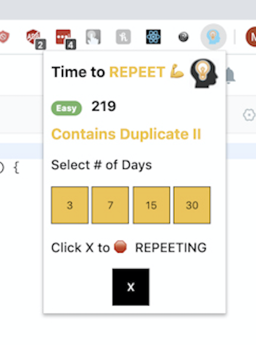
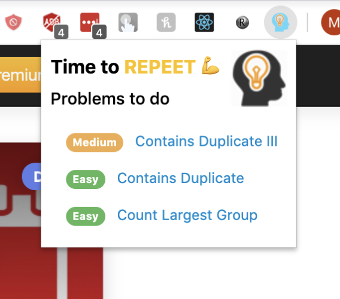
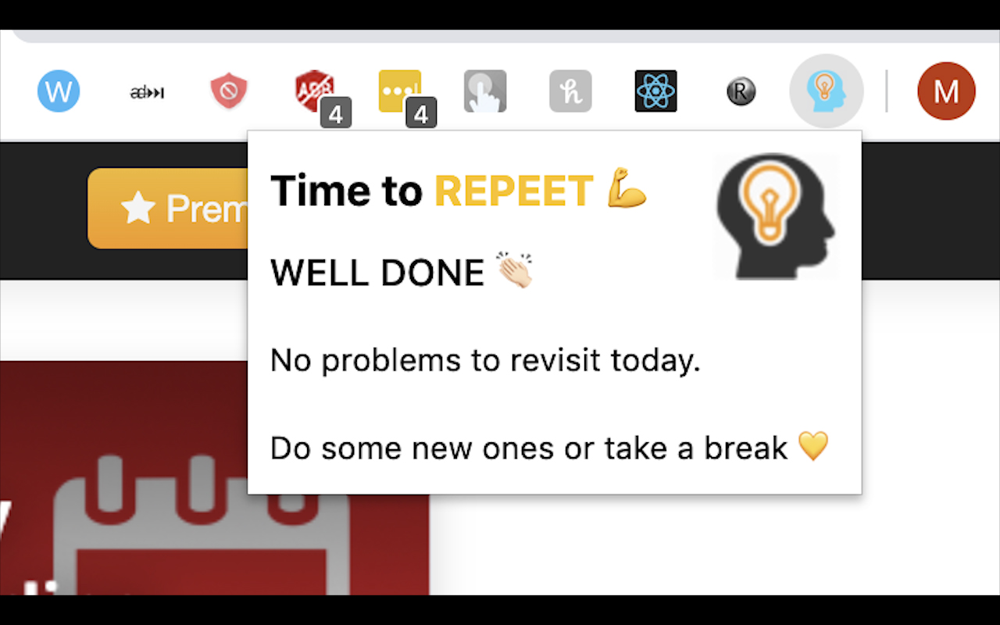

  

<h5 align="center">A chrome extension for Long Term Problem Retention on leetcode.com</h5>

## Motivation

Very often users solve, optimise, learn coding problems on leetcode.com. However about 5 days after learning the solution they completely forget what they learnt. It has nothing to do with the users memory but the fact that the problem wasn't reviewed again to make it permanent in the memory. 
This is also described in detail in an algorithm called the Spaced Repetition Algorithm.
Due to this users also fail coding interviews despite working very hard because they face the same problem in coding interviews. They have previously solved several problems but they are not able to retain or remember the logic clearly as the knowledge and algorithms get dusty. 
Several people also ask how to leetcode properly so this also helps with staying in a rhythm of problem solving and also gives a sense of satisfaction.

## How does this help & Usage Instructions

Long term retention happens when we revisit those problems at regular intervals of time so that they get fixated in the memory.

This idea is explained by an algorithm called Spaced Repetition which has been implemented in this extension with a fair deal of flexibility where the user can select the repetition timeframe of the problem to be reviewed and the extension will show a comprehensive list of problems to be reviewed each day.

So here is an extension to keep that knowledge sparkling forever. 
Link: https://chrome.google.com/webstore/detail/leet-repeet/odpadfgphijikfmdaefmhpjdebahnmde

This chrome extension allows users to schedule when they would like to review a problem on a pop up like this. Currently options for 3, 7, 15 and 30 days are given.
If the user doesn't want to see the problem anymore the 'X' button will remove it from the queue.

  

Once the user selects the time frame then on the date requested a pop up with the problems is shown. Currently a limit of 5 problems per day is set.

  

If there are no problems scheduled for today. The following popup is displayed.

  

Good Luck on your preparation coders :)

